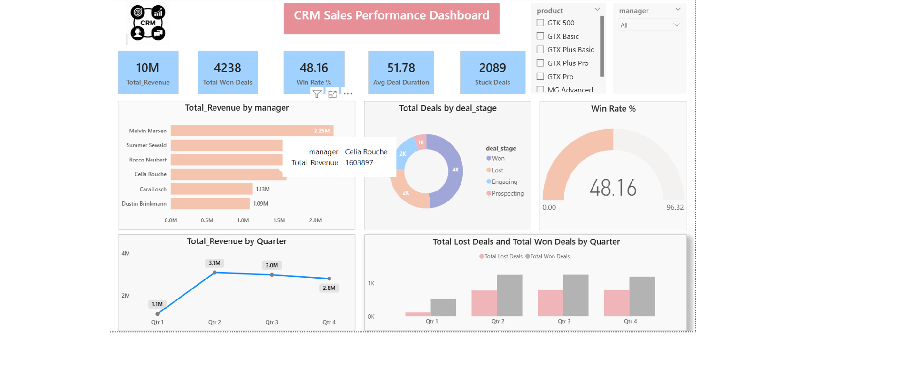
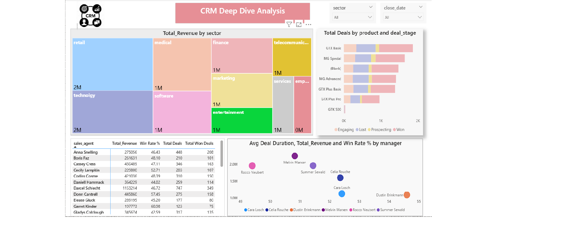
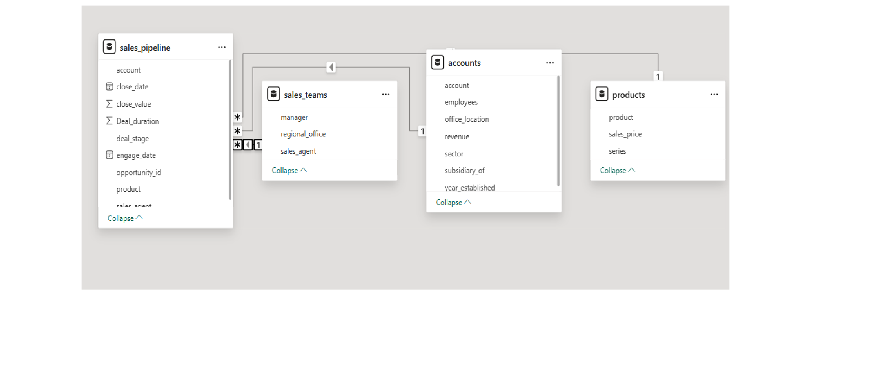
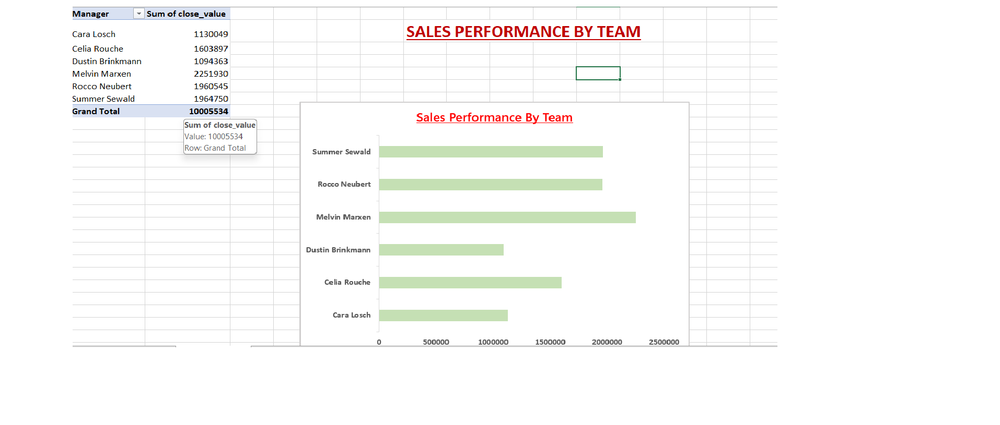

# CRM_Sales_Analysis_Project
---
# Overview
- This project explores a B2B CRM sales dataset to analyze revenue trends, sales team performance, product effectiveness, and pipeline risks. Using Excel for data preparation, SQL for advanced analysis, and Power BI for visualization, the project delivers actionable insights and recommendations to improve win rates and drive revenue growth.
---
# Project_Assests
- [CRM RAW DATASETS](./CRM_RAW_Dataset)
- [CRM CLEANED DATASETS](./CRM_Cleaned_Dataset)
- [SQL ANALYSIS](CRM_Sales_Ananlysis.sql)
- [EXCEL ANALYSIS](CRM_analysis.xlsx)
- [POWER BI](CRM_Sales_Analysis_Dashboard.pbix)
- [DASHBOARD_PREVIEW](./Dashboard_Preview)
 --- 
# Tools Used 
- **Excel:**  Data cleaning, pivot tables, data modeling.
- **SQL(SSMS):**  Advanced queries, aggregations, window functions, joins.
- **Power BI:**  Interactive dashboards & DAX measures.
 ---
 # Data Preparation( EXCEL)
- Handled missing values (open deals identified via null close dates)
- Created Deal Duration metric.
- Standardized revenue format.
- Checked duplicates values.
- Built data model with relationships across 4 tables.
- Made pivot table from data model
- made charts out of pivot table
---
# Key Analysis

# 💰 Revenue Insights
- **Total Revenue:**  $10M+
- **Best Quarter:**  Q2 2017 ($3.08M)
- **Revenue declined** in **Q3 & Q4** → indicates seasonality or drop-off
  
# 🏆 Sales Performance
- **Top Manager:**  Melvin Marxen ($2.25M revenue).
-   Significant performance gap between top & bottom teams.

# 🛍️ Product Performance
- **Best Products:**  GTX Plus Pro, GTXPro (~49% win rate)
- **Worst Product:** GTK 500 (37.5% win rate, very low volume)

# 🌍 Sector Insights
- **Highest Revenue:** Retail
- **Highest Win Rate:**  Marketing (~60%)
- **Opportunity:** High win-rate sectors not fully utilized

# ⚠️ Pipeline Health
- 2,089 deals stuck in pipeline
- **Oldest deal:**  3,444 days (~9 years!)
- **Avg deal cycle:**  ~52 days
---
 # 📊 SQL Analysis Performed
- Calculated total revenue from won deals.
- Measured product-wise win rates.
- Evaluated sales team performance (revenue & deal success).
- Analyzed quarter-over-quarter revenue trends.
- Identified high-performing industry sectors.
- Detected stuck deals in pipeline based on duration.
- Ranked sales agents based on revenue performance.
---
# 🛠️ Techniques Used
- **Aggregations:** SUM(), COUNT(), AVG()
- **Conditional Logic**: CASE WHEN
- **Joins:** Multi-table joins (sales, accounts, products, teams)
- **Window Functions:** LAG(), RANK()
- **Date Functions:** DATEDIFF, DATEPART, YEAR, GETDATE()
- **Data Transformation:** Filtering, grouping, sorting (WHERE, GROUP BY, ORDER BY)
---
# 📊 Power BI Dashboard
**Page 1:  Sales Performance Overview:**
- Displays key KPIs such as revenue, win rate, average deal duration, and stuck deals.
- Shows revenue trends over time to identify growth patterns.
- Compares performance across different sales teams.
- Visualizes distribution of deals across various stages.
  
**Page 2: Deep Dive Analysis:**
- Analyzes performance across sectors and products.
- Provides agent-level insights on revenue and win rate.
- Examines relationship between deal duration and revenue to assess efficiency.
---
# Dashboard Preview
 
**Sales Performance Dashboard**
  
 
**Deep dive analysis dashboard**
  

 **Model_Relationship** 
  

**Sales by team**

--- 
# 💡 Key Recommendations
- 🎯 Focus on high-performing products **(GTX Plus Pro, GTXPro)**.
- ⚠️ Re-evaluate or drop **GTK 500**.
- 📚 Replicate top team strategies across teams.
-🔧 Clean up stuck pipeline (huge revenue opportunity).
- 🌍 Increase focus on **Marketing & Software sectors**.
- 📅 Analyze **Q2** success factors to improve consistency.
--- 
# 🚀 Business Impact
- Identified potential **10–15% revenue growth** through improved pipeline management.
- Highlighted high-performing products and sectors for better sales focus.
- Detected underperforming areas, guiding strategy and resource optimization.
- Uncovered **2,000+ stuck deals**, indicating significant untapped revenue.
- Enabled data-driven decisions to improve win rates and sales efficiency.
---
# Conclusion
- This project demonstrates how data analysis can be used to uncover key sales insights, improve decision-making, and identify growth opportunities by combining Excel, SQL, and Power BI.
  

